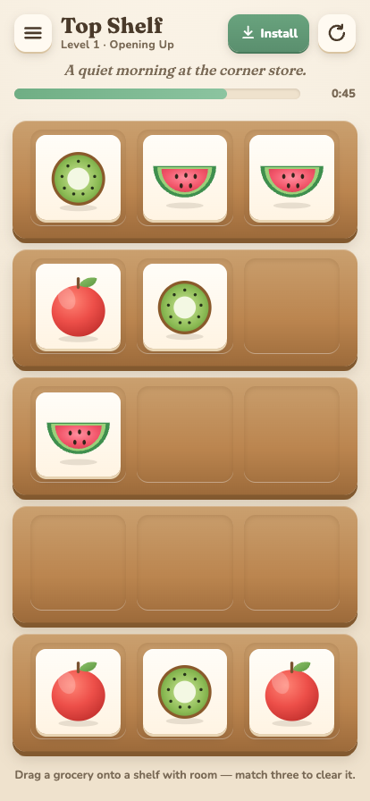

# Top Shelf: Grocery Sort

**▶ [Play it live](https://lux-username.github.io/top-shelf/)** — runs in any browser,
installs to your phone home screen, plays fully offline.

A cozy grocery-sorting puzzle. **No ads, no purchases, no lives — ever.** Sort each
shelf so all three slots hold the same grocery; cleared shelves become breathing room.
110 hand-tuned levels across eleven departments; your pick of a gentle timer, a
tidy-solve (beat-par) challenge, or neither; a free hint whenever you want one; and a
little shop that stocks itself as you finish each aisle. Unlimited retries with stable
boards, so a good plan always pays off.

Built as a single, dependency-free web app that installs to a phone home screen (PWA) and
plays fully offline.

<p align="center">
  
</p>

## Files

| File | What it is |
|------|------------|
| `index.html` | The whole game — one self-contained file (logic, levels, styles). |
| `manifest.webmanifest` | PWA manifest (name, icons, install behavior). |
| `sw.js` | Service worker — offline caching + installability. |
| `icon-192.png`, `icon-512.png`, `apple-touch-icon.png` | App / home-screen icons (three-item scene). |
| `favicon.ico`, `favicon-16.png`, `favicon-32.png`, `favicon-48.png` | Browser-tab favicons (single hero apple). |
| `tests/harness.js` | Node script that verifies every level is solvable and fast. |
| `tests/gen-icon.js` | Regenerates the app icons (no dependencies). |
| `*.md` (handoff / progress / level-design) | Design + engineering notes. |

## Play locally

Open `index.html` in any browser, or serve the folder:

```sh
python3 -m http.server 8000
# then visit http://localhost:8000/
```

(The service worker and "Add to Home Screen" only activate over http/https, not when
opening the file directly — but the game itself runs either way.)

## Put it online for free

The game is just static files, so any free static host works. You only need one. After
deploying, share the URL — on iPhone, open it in Safari and tap **Share → Add to Home
Screen** to install it like an app (fullscreen, offline). Android Chrome offers an
**Install app** prompt.

**Option A — Netlify Drop (easiest, no account setup, ~1 min):**
1. Go to <https://app.netlify.com/drop>.
2. Drag this whole folder onto the page.
3. You get a live `https://…netlify.app` URL. Done.

**Option B — Cloudflare Pages / Vercel:** same idea — create a free project and upload
the folder (or connect a Git repo). Both give an HTTPS URL on a free tier.

**Option C — GitHub Pages (free, durable, needs a GitHub account):**
1. Create a new repository and push these files (this folder is already a git repo —
   `git remote add origin <your-repo-url> && git push -u origin main`).
2. In the repo: **Settings → Pages → Build and deployment → Source: Deploy from a
   branch**, pick `main` / `/ (root)`, save.
3. Your URL appears as `https://<user>.github.io/<repo>/` within a minute.

> After any change to `index.html` or the assets, bump `CACHE` in `sw.js` (e.g.
> `topshelf-v2` → `topshelf-v3`) so returning players get the update instead of the
> cached copy.

## Verify the levels

```sh
node tests/harness.js          # all levels
node tests/harness.js 51 60    # a range (1-based, inclusive)
```

Every level must print `OK` and generate quickly. Run this after editing level defs or
the generator.

## License

**Source-available, free to play, noncommercial** — [PolyForm Noncommercial
1.0.0](LICENSE). The code is public to read, learn from, and modify for any
noncommercial purpose. Commercial use — including running ads or selling it — is not
permitted. All commercial rights are reserved by the author.
